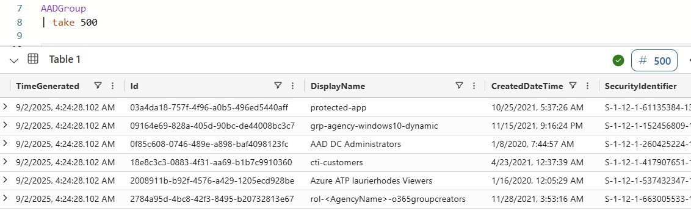
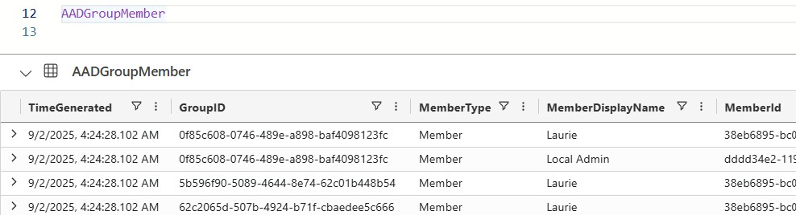

# AAD User and Group Export to ADX

Azure Function App that exports Azure AD identity data to Azure Data Explorer via Event Hub.


**Example AAD Groups:**



**Example AAD Group Members:**




## Overview

Automated extraction of Azure AD users, groups, and membership relationships using Microsoft Graph API with streaming delivery to Azure Data Explorer.

### Features

- Comprehensive user property retrieval via multiple Graph API calls
- Complete group enumeration and membership mapping
- Managed identity authentication (password-less)
- Automatic retry with exponential backoff
- Event Hub streaming with intelligent chunking
- Application Insights telemetry
- Scheduled execution (daily at 01:00 UTC)
- On-demand HTTP trigger

## Data Schema

### Event Hub Message Envelope

```json
{
  "OdataContext": "users|groups|GroupMembers",
  "ExportId": "correlation-guid",
  "ExportTimestamp": "2025-10-01T01:00:00.000Z",
  "GroupID": "group-guid-if-applicable",
  "Data": {
    // Microsoft Graph API response object
  }
}
```

### User Properties

Export includes 80+ user properties across multiple categories:

- Identity (id, userPrincipalName, securityIdentifier)
- Contact (mail, phone, address)
- Organisation (employeeId, department, manager)
- Licences (assignedLicenses, provisionedPlans)
- On-premises sync (onPremisesSyncEnabled, distinguishedName)
- Optional: SharePoint properties (aboutMe, skills, interests)

### Group Properties

All standard group properties including:

- Classification, description, displayName
- Mail settings and addresses
- Membership rules (for dynamic groups)
- Security and provisioning settings

### Permissions

**Microsoft Graph (Application):**

- `User.Read.All` - Read user profiles
- `Group.Read.All` - Read groups
- `GroupMember.Read.All` - Read memberships

**Event Hub:**

- `Azure Event Hubs Data Sender` - Send messages


## Project Structure

```
├── infrastructure/
│   ├── main.bicep              # Infrastructure template
│   └── parameters.json         # Deployment parameters
├── src/FunctionApp/
│   ├── host.json              # Function App configuration
│   ├── profile.ps1            # Startup script
│   ├── requirements.psd1      # PowerShell dependencies
│   ├── TimerTriggerFunction/  # Scheduled trigger
│   ├── HttpTriggerFunction/   # Manual trigger
│   └── modules/
│       ├── AADExporter.psm1   # Module loader
│       └── public/            # Exported functions
│           ├── Invoke-AADDataExport.ps1
│           ├── Export-AADUsers.ps1
│           ├── Export-AADGroups.ps1
│           ├── Export-AADGroupMemberships.ps1
│           ├── Get-AzureADToken.ps1
│           ├── Send-EventsToEventHub.ps1
│           └── [helper functions]
└── docs/                      # Technical documentation
```

## Licence

MIT Licence - see [LICENSE](LICENSE) file for details.

## Authors

Laurie Rhodes

# 
