# System Architecture

## 🏗️ **High-Level Architecture**

The AAD Export to ADX solution follows a serverless, event-driven architecture designed for enterprise scalability and security.

```mermaid
graph TB
    subgraph "Azure AD Tenant"
        Users[👥 Users]
        Groups[📁 Groups]
        Members[🔗 Memberships]
    end

    subgraph "Azure Function App"
        Timer[Timer Trigger<br/>Daily @ 1 AM]
        HTTP[HTTP Trigger<br/>Manual Testing]
        Core[Invoke-AADDataExport<br/>Core Logic]
        Auth[Get-AzureADToken<br/>Authentication]
        EventSend[Send-EventsToEventHub<br/>Data Streaming]
    end

    subgraph "Azure Services"
        MI[Managed Identity]
        EH[Event Hub]
        ADX[Azure Data Explorer]
        AI[Application Insights]
    end

    Timer --> Core
    HTTP --> Core
    Core --> Auth
    Auth --> MI
    MI --> Users
    MI --> Groups
    MI --> Members
    Core --> EventSend
    EventSend --> EH
    EH --> ADX
    Core --> AI

    classDef azure fill:#0078d4,stroke:#fff,stroke-width:2px,color:#fff
    classDef function fill:#ff6b35,stroke:#fff,stroke-width:2px,color:#fff
    classDef data fill:#00bcf2,stroke:#fff,stroke-width:2px,color:#fff

    class MI,EH,ADX,AI azure
    class Timer,HTTP,Core,Auth,EventSend function
    class Users,Groups,Members data
```



## 🔧 **Component Details**

### **Function Triggers**

#### **Timer Trigger Function**

- **Purpose**: Scheduled daily execution
- **Schedule**: Daily at 1:00 AM UTC (`0 0 1 * * *`)
- **Timeout**: 4 hours maximum execution time
- **Monitoring**: Full Application Insights telemetry

#### **HTTP Trigger Function**

- **Purpose**: Manual execution for development and testing
- **Authentication**: Function key required
- **Methods**: GET and POST supported
- **Response**: JSON status with execution details

### **Core Modules**

#### **AZRest PowerShell Module**

Custom module providing Azure REST API functionality:

```powershell
# Module Structure
AZRest/
├── AZRest.psd1          # Module manifest
├── AZRest.psm1          # Module loader
└── public/              # Exported functions
    ├── Get-AzureADToken.ps1
    ├── Send-EventsToEventHub.ps1
    └── Invoke-AADDataExport.ps1 (planned)
```

#### **Authentication Flow**


## 📊 **Data Flow Architecture**

### **Export Process Flow**


### **Data Transformation**

#### **Input: Microsoft Graph API Response**

```json
{
  "@odata.context": "https://graph.microsoft.com/beta/$metadata#users",
  "@odata.nextLink": "https://graph.microsoft.com/beta/users?$skiptoken=...",
  "value": [
    {
      "id": "12345678-1234-1234-1234-123456789012",
      "displayName": "John Doe",
      "userPrincipalName": "john.doe@contoso.com",
      // ... additional user properties
    }
  ]
}
```

#### **Output: Event Hub Message Format**

```json
[
  {
    "OdataContext": "users",
    "Data": {
      "id": "12345678-1234-1234-1234-123456789012",
      "displayName": "John Doe",
      "userPrincipalName": "john.doe@contoso.com"
      // ... complete user object
    }
  }
]
```

## 🔐 **Security Architecture**

### **Authentication & Authorization**


### **Required Permissions**

| Permission          | Justification                | Risk Level |
| ------------------- | ---------------------------- | ---------- |
| `User.Read.All`     | Read user profile data       | Low        |
| `Group.Read.All`    | Read group information       | Low        |
| `AuditLog.Read.All` | Access audit logs (optional) | Medium     |

### **Security Controls**

- **No Stored Credentials**: Managed identity eliminates password management
- **Minimal Permissions**: Least privilege access to Graph API
- **Network Security**: HTTPS-only communication
- **Audit Logging**: All operations logged to Application Insights

## ⚡ **Performance Architecture**

### **Scalability Considerations**

| Component        | Scaling Strategy              | Limits                   |
| ---------------- | ----------------------------- | ------------------------ |
| **Function App** | Consumption plan auto-scaling | 200 concurrent instances |
| **Graph API**    | Rate limiting + retry logic   | 1000+ requests/minute    |
| **Event Hub**    | Partition-based throughput    | 1000 TUs maximum         |
| **Memory Usage** | Chunked processing            | 1.5 GB per instance      |

### **Optimization Strategies**

1. **Pagination**: Process Graph API results in manageable chunks
2. **Batching**: Group Event Hub messages for efficiency
3. **Retry Logic**: Exponential backoff for transient failures
4. **Memory Management**: Stream large datasets rather than loading entirely

## 🏃‍♂️ **Execution Flow**

### **Detailed Process Steps**


### **Error Handling Flow**


## 🔄 **Data Pipeline Architecture**

### **End-to-End Data Flow**


### **Event Hub Message Structure**

#### **User Records**

```json
{
  "OdataContext": "users",
  "Data": {
    "id": "user-guid",
    "displayName": "John Doe",
    "userPrincipalName": "john.doe@contoso.com",
    "jobTitle": "Senior Developer",
    "department": "Engineering",
    "accountEnabled": true,
    "createdDateTime": "2023-01-15T10:30:00Z",
    "businessPhones": ["+1-555-0123"],
    "officeLocation": "Building A, Floor 3"
  }
}
```

#### **Group Records**

```json
{
  "OdataContext": "groups",
  "Data": {
    "id": "group-guid",
    "displayName": "Engineering Team",
    "groupTypes": ["Unified"],
    "securityEnabled": true,
    "mailEnabled": true,
    "createdDateTime": "2023-01-10T08:00:00Z"
  }
}
```

#### **Group Member Records**

```json
{
  "OdataContext": "GroupMembers",
  "GroupID": "group-guid",
  "Data": "user-or-group-guid"
}
```

## 🏗️ **Infrastructure Components**

### **Azure Function App Configuration**

```json
{
  "functionTimeout": "04:00:00",
  "healthMonitor": {
    "enabled": true,
    "healthCheckInterval": "00:00:10"
  },
  "extensionBundle": {
    "id": "Microsoft.Azure.Functions.ExtensionBundle",
    "version": "[4.*, 5.0.0)"
  }
}
```

### **Managed Identity Setup**

- **Type**: User-assigned managed identity
- **Scope**: Microsoft Graph API access
- **Permissions**: Minimal required (User.Read.All, Group.Read.All)
- **Security**: No stored credentials or secrets

### **Event Hub Configuration**

- **Namespace**: Dedicated namespace for identity data
- **Partitions**: Multiple partitions for parallel processing
- **Retention**: 7-day message retention
- **Throughput**: Auto-scaling based on load

## 📈 **Scalability & Performance**

### **Design Patterns**

#### **Pagination Handling**

```powershell
do {
    $response = Invoke-RestMethod -Uri $apiUrl -Headers $authHeader
    # Process current page
    $apiUrl = $response.'@odata.nextLink'
} while ($null -ne $apiUrl)
```

#### **Chunked Event Hub Delivery**

```powershell
# Ensure messages don't exceed Event Hub 1MB limit
$maxPayloadSize = 900KB
# Split large collections into manageable chunks
```

#### **Rate Limit Management**

```powershell
Start-Sleep -Seconds 2  # Respect Graph API limits
# Future: Implement exponential backoff
```

### **Performance Metrics**

| Metric             | Small Tenant | Large Tenant  | Enterprise |
| ------------------ | ------------ | ------------- | ---------- |
| **Users**          | < 1,000      | 1,000-10,000  | 50,000+    |
| **Groups**         | < 100        | 100-1,000     | 5,000+     |
| **Execution Time** | 2-5 minutes  | 10-30 minutes | 1-4 hours  |
| **Memory Usage**   | 50-100 MB    | 200-500 MB    | 1-1.5 GB   |
| **API Calls**      | 10-50        | 100-500       | 1,000+     |

## 🔒 **Security Design**

### **Authentication Architecture**


### **Network Security**

- **TLS 1.2+**: All communications encrypted in transit
- **HTTPS Only**: Function app configured for HTTPS-only access
- **Private Endpoints**: Optional VNet integration for enhanced security
- **Firewall Rules**: Configurable IP restrictions

### **Data Protection**

- **At Rest**: Event Hub and ADX encryption enabled by default
- **In Transit**: TLS encryption for all API communications
- **Access Control**: RBAC-based permissions throughout pipeline
- **Audit Trail**: Complete operation logging in Application Insights

## 🔄 **Error Handling Strategy**

### **Error Classification**


### **Retry Patterns**

| Error Type           | Retry Strategy        | Max Attempts |
| -------------------- | --------------------- | ------------ |
| **429 Rate Limited** | Exponential backoff   | 5            |
| **5xx Server Error** | Linear backoff        | 3            |
| **Network Timeout**  | Immediate retry       | 2            |
| **401 Unauthorized** | Token refresh + retry | 1            |

## 🔍 **Monitoring Architecture**

### **Telemetry Collection**


### **Key Performance Indicators**

- **Success Rate**: Percentage of successful executions
- **Execution Duration**: Time to complete full export
- **Graph API Latency**: Response times for Microsoft Graph calls
- **Event Hub Throughput**: Messages per second delivered
- **Error Rates**: Breakdown by error type and frequency

## 🔧 **Deployment Architecture**

### **Infrastructure as Code**


### **Environment Configuration**

| Environment     | Purpose                   | Configuration                  |
| --------------- | ------------------------- | ------------------------------ |
| **Development** | Local testing             | Mock services, reduced logging |
| **Staging**     | Pre-production validation | Full monitoring, test data     |
| **Production**  | Live data export          | Enterprise monitoring, alerts  |

## 🧩 **Module Dependencies**

### **PowerShell Module Graph**


### **External Dependencies**

```powershell
# requirements.psd1
@{
    'AzTable' = '2.*'                    # Azure Table Storage
    'Az.OperationalInsights' = '3.*'     # Log Analytics queries
    'Az.Resources' = '5.*'               # Resource management
    'Az.Storage' = '5.*'                 # Storage operations
}
```

## 🔄 **Data Consistency & Reliability**

### **Consistency Model**

- **Eventually Consistent**: Data appears in ADX within minutes of export
- **At-Least-Once Delivery**: Event Hub guarantees message delivery
- **Idempotent Operations**: Safe to retry failed exports
- **Audit Trail**: Complete operation history in Application Insights

### **Reliability Patterns**

- **Circuit Breaker**: Prevent cascading failures
- **Bulkhead Isolation**: Separate user/group/member processing
- **Timeout Management**: Configurable timeouts for all operations
- **Health Checks**: Monitor function app and dependency health

---

## 📋 **Deployment Considerations**

### **Resource Sizing**

| Component                | Recommended Size  | Rationale                         |
| ------------------------ | ----------------- | --------------------------------- |
| **Function App**         | Consumption Plan* | Auto-scaling based on demand      |
| **Storage Account**      | Standard LRS      | Function app storage requirements |
| **Event Hub**            | Standard Tier     | 1000 TU capacity sufficient       |
| **Application Insights** | Standard          | Full feature set required         |

Note that long running Function Apps (more than 10 minutes in duration) need to be hosted on an organisational AppService Plan.  By using a PowerShell Function App, this may share a Windows App Service Plan with Logic Apps used by the SOC.